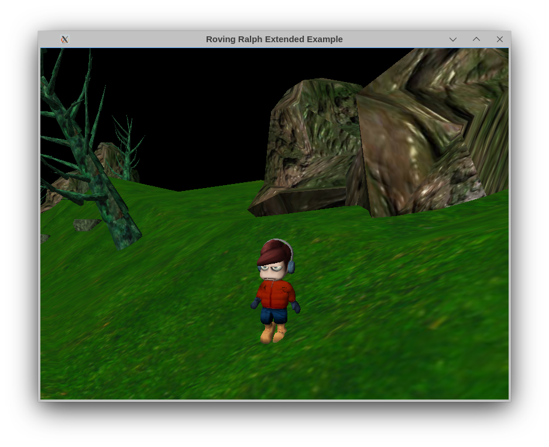

# Panda3d C++ Example: Roaming Ralph Extended

A sample Panda3d project using C++ based on the Roaming Ralph example, with a different approach than the original C++ translation of the example.



## About

I was off sick for a few days and wanted to mess around with Panda3D in C++, never having used Panda3d before. I couldn't find a lot of C++ examples for it though, and some I found were quite dated and refused to compile out-of-the-box. Once I got them to build, I decided to work on an updated example based on "Roaming Ralph" with a more modular approach, and develop a more usable player and camera control system.

I tried to leave comments in a lot of places, including the build configuration, in the hopes that people might be able to use this as a learning resource. It could even possibly serve as a boilerplate template for really simple games. Fair warning though - I'm still new to Panda3d and I'm more at home in either C# or plain C than C++, so I apologize if there's any unidiomatic design choices.


### What's different from normal Roaming Ralph?
  - No UI text (not novel enough to bother with it)
  - Uses the meson build system (no technical reason; I just prefer it.)
  - Rudimentary gamepad support (tested with wired Xbox One controller on Linux)
  - Ability to remap keyboard keys and controller buttons via config files
  - Player controls that don't suck (the original roaming ralph example was really unintuitive there)
  - Reusable third-person orbit camera class that operates on any NodePath as a target
### Controls

Read [keyboard.cfg](keyboard.cfg) or [gamepad.cfg](gamepad.cfg) for the control mapping. Keep in mind that the only controls that do anything are the movement and camera controls, beyond that the player doesn't "do" anything.

### Problems
  - One must press a gamepad button on the gamepad before the thumbsticks will work.
    This is just because of the way the InputController class switches between the keyboard
    and the gamepad. Should be an easy fix, I'd imagine.
  - The executable must run with the root of the repository as the working directory, or else it will not be able to find the key/gamepad mapping config files
  - There's a few configuration knobs and variables that are unimplemented.

### Extras

Almost forgot: this repo also includes some classes from [drunken-octo-robot/p3util](https://github.com/drivird/drunken-octo-robot/tree/master/p3util) in the `ext` subdirectory that were modified slightly to compile with meson as a static library that can later be linked in with the final game executable. I only use the CActor class here, but I've left everything else I bothered to integrate in case it proves useful.

## Building & Running

I've only ever built and ran this on Arch Linux with panda3d installed from the AUR. In my case I had installed the `eigen3` and `bullet` packages before panda3d. The build configuration will probably work out of the box on any linux system where Panda3d headers and libraries are installed to `/usr/include` and `/usr/lib`. If Panda3d is installed somewhere else, see the configuration section below

If you know a thing or two about meson, it probably wouldn't be too hard to make this project compile on Windows, but again I haven't tried.

### Dependencies

On Arch Linux:
```bash
# update
yay -Syu
# install meson and compiler if not already
yay -S --needed meson gcc
# install optional dependencies
yay -S --needed bullet eigen3
# install panda3d
yay -S --needed panda3d
```

### Configuring the project

(all commands below to be run from the root of the repository)

Default panda3d search paths:
```bash
meson setup build
```

or if panda3d was installed to `/usr/local/` instead:

```bash
meson setup build -Dpanda3d_headers_prefix=/usr/local/include -Dpanda3d_libraries_prefix=/usr/local/lib
```

### Building the project

```bash
meson compile -C build
```

### Running

```bash
./build/roaming-ralph-extended
```

### Debugging & Development

I used zed as my text editor of choice; it integrates niceley with clang-format and I have included the assosicated configs.

For stepping through with a debugger, there's a build & launch configuration for VS Code ready to go in the repo so the easiest thing to do would be open the repo in VS Code and start debugging.

## Thanks

Thanks to [Dominique Rivard / drivird](https://github.com/drivird) for the [drunken-octo-robot](https://github.com/drivird/drunken-octo-robot) repository of Panda3d samples rewritten in C++.

As well thanks to [darktjm](https://gitlab.com/darktjm1)  for the other [collection of C++ panda3d samples](https://gitlab.com/darktjm1/c-p3d-samples). I discovered these while trying to figure out the gamepad input and it made things a whole lot clearer.

## Any Problems?

Sorry friend, you're gonna have to figure it out. I'll gladly review and merge any pull requests that fix legitimate issues but beyond that I can't offer much assistance.
